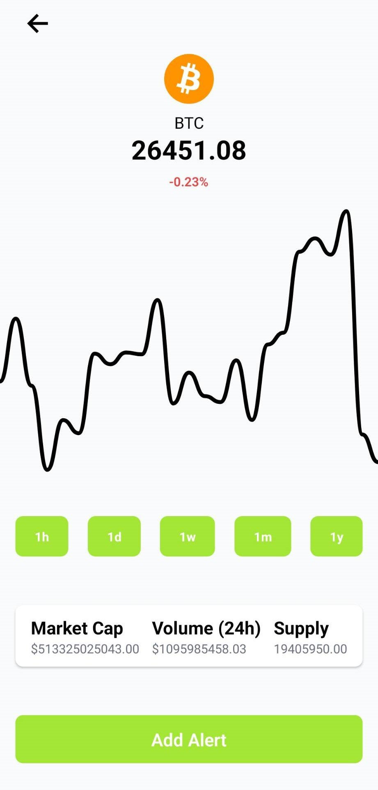
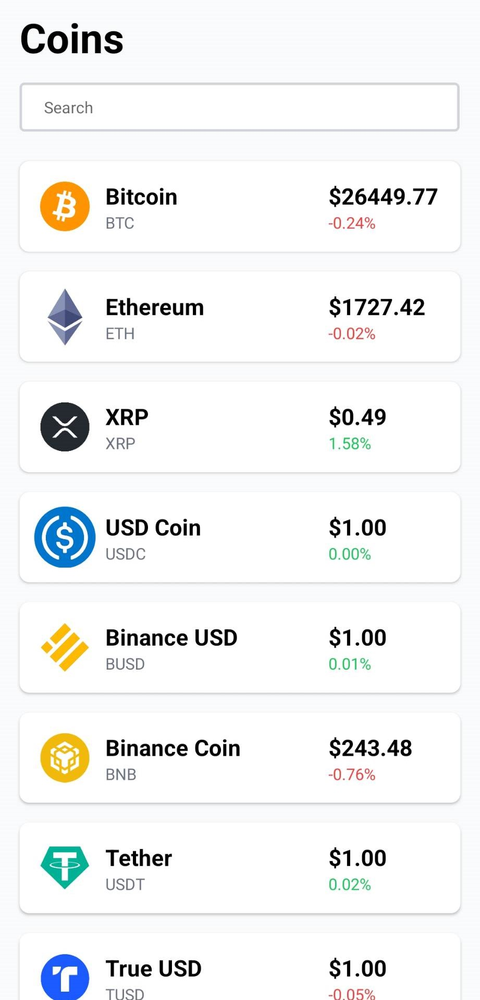

# CryptoTracker
This is a small project developed to learn how to use React-Native for mobile app development.

## About
The CryptoTracker App is a simple cryptocurrency tracker that allows users to stay updated on the latest prices and charts of various cryptocurrencies. The app fetches real-time data using websockets from  [CryptoCompare](https://www.cryptocompare.com/) Additionally, it provides a notification feature that alerts users when the price of a particular cryptocurrency reaches a predefined alert level.

##Limitations
The app does not provide notifications when it is not actively running.

  
  

